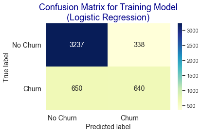

## Project 1 : [Data Cleansing (Data Telco)](https://github.com/WandaDP/DataCleansing)
### Code and Resources :
- Language : Python 3.6
- Library : Pandas, Matplotlib, Seaborn
- Dataset : https://dqlab-dataset.s3-ap-southeast-1.amazonaws.com/dqlab_telco.csv
#
#

## Project 2 : [Customer Churn Prediction Using Machine Learning with Data Telco](https://github.com/WandaDP/CustomerChurnPrediction)
- We will be able to understand and practice how to predicting customer churn using machine learning.
- Perform testing on several models (Linear Regression, Gradient Boosting, Random Forest) 
- Determining the best model

### Code and Resources :
- Python Version: 3.6
- Packages: pandas, matplotlib, seaborn, numpy, sklearn
- Dataset : https://dqlab-dataset.s3-ap-southeast-1.amazonaws.com/dqlab_telco_final.csv
- Case Study : DQLab
#
#

## Project 3 : [DQLab Sport Center Data Analysis](https://github.com/WandaDP/DQLabSportCenterDataAnalysis)
### Code and Resources :
- Python Version: 3.6
- Packages: pandas, matplotlib, seaborn, numpy, sklearn
- Dataset : https://dqlab-dataset.s3-ap-southeast-1.amazonaws.com/data_retail.csv
- Case Study : DQLab
#
#

## Project 4 : [Customer Segmentation for Markerting](https://github.com/WandaDP/CustomerSegmentation)
- We will be able to understand and practice how to perform customer segmentation techniques using python
- Segmenting customers in Python using the K-Prototypes algorithm
- Search for the optimal number of segments using elbow method
- Initial data processing by changing text fields to numeric and standardizing numeric fields.
- Creating and optimizing models using the k-prototype algorithm.
- Using models to predict new data.

### Code and Resources :
- Python Version: 3.6
- Dataset : https://dqlab-dataset.s3-ap-southeast-1.amazonaws.com/customer_segments.txt
- Algorithm : K-Prototype (K-means & K-Modes)
- Case Study : DQLab
